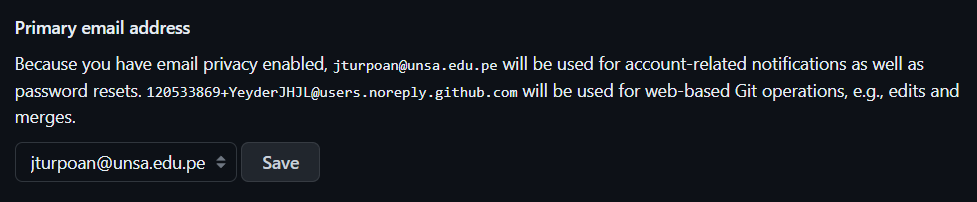
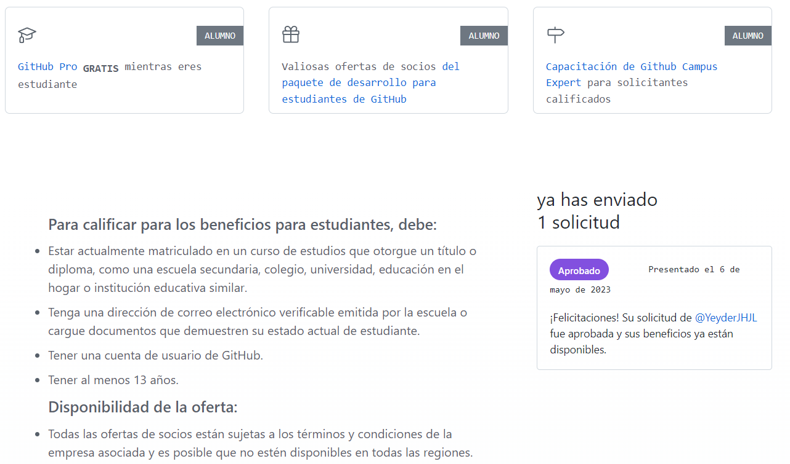
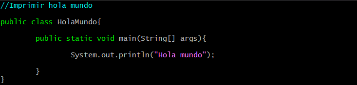
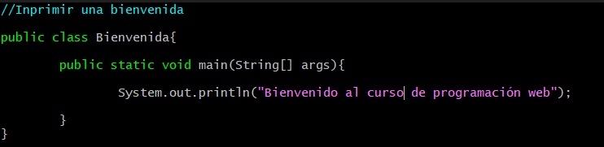
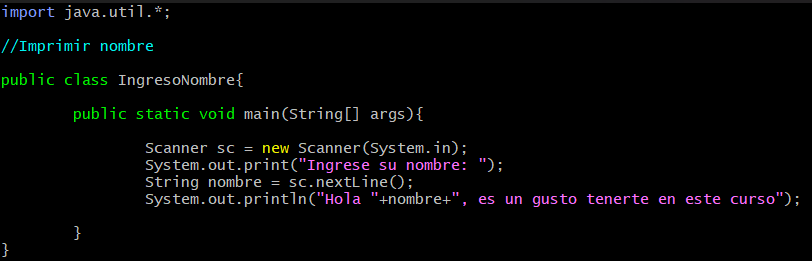
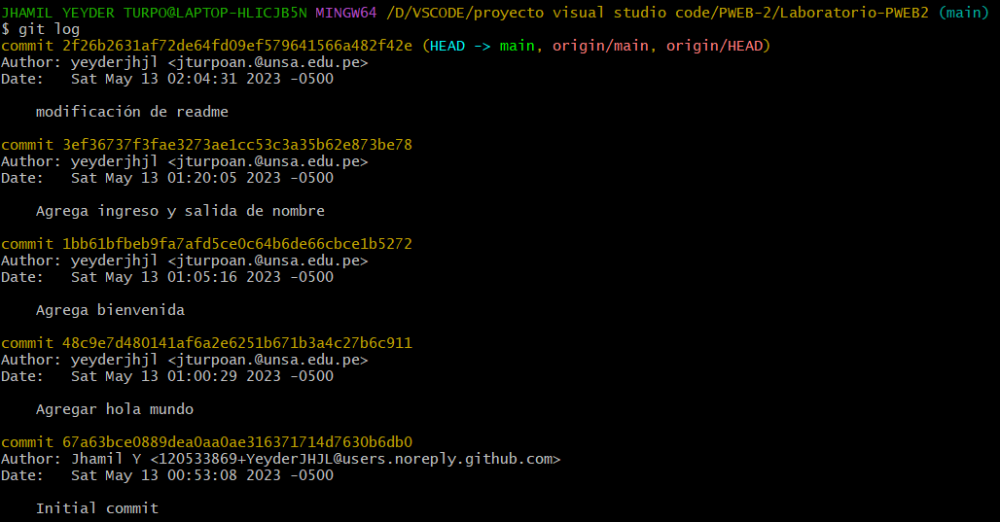

<div align="center">
<table>
    <theader>
        <tr>
            <td></td>
            <th>
                <span style="font-weight:bold;">UNIVERSIDAD NACIONAL DE SAN AGUSTIN</span><br />
                <span style="font-weight:bold;">FACULTAD DE INGENIERÍA DE PRODUCCIÓN Y SERVICIOS</span><br />
                <span style="font-weight:bold;">DEPARTAMENTO ACADÉMICO DE INGENIERÍA DE SISTEMAS E INFORMÁTICA</span><br />
                <span style="font-weight:bold;">ESCUELA PROFESIONAL DE INGENIERÍA DE SISTEMAS</span>
            </th>
            <td></td>
        </tr>
    </theader>
    <tbody>
        <tr><td colspan="3"><span style="font-weight:bold;">Formato</span>: Guía de Práctica de Laboratorio</td></tr>
        <tr><td><span style="font-weight:bold;">Aprobación</span>:  2022/03/01</td><td><span style="font-weight:bold;">Código</span>: GUIA-PRLD-001</td><td><span style="font-weight:bold;">Página</span>: 1</td></tr>
    </tbody>
</table>
</div>

<div align="center">
<span style="font-weight:bold;">GUÍA DE LABORATORIO</span><br />
</div>


<table>
<theader>
<tr><th colspan="6">INFORMACIÓN BÁSICA</th></tr>
</theader>
<tbody>
<tr><td>ASIGNATURA:</td><td colspan="5">Programación Web 2</td></tr>
<tr><td>TÍTULO DE LA PRÁCTICA:</td><td colspan="5">Vim - Git - GitHub</td></tr>
<tr>
<td>NÚMERO DE PRÁCTICA:</td><td>01</td><td>AÑO LECTIVO:</td><td>2023 A</td><td>NRO. SEMESTRE:</td><td>III</td>
</tr>
<tr>
<td>FECHA INICIO::</td><td>12-May-2023</td><td>FECHA FIN:</td><td>13-May-2023</td><td>DURACIÓN:</td><td>04 horas</td>
</tr>
<tr><td colspan="6">RECURSOS:
    <ul>
        <li><a href="https://git-scm.com/book/es/v2">https://git-scm.com/book/es/v2</a></li>
        <li><a href="https://guides.github.com/">https://guides.github.com/</a></li>        
        <li><a href="https://www.w3schools.com/java/default.asp">https://www.w3schools.com/java/default.asp</a></li>
    </ul>
</td>
</<tr>
<tr><td colspan="6">DOCENTE:
<ul>
<li>Anibal Sardon</li>
</ul>
</td>
</<tr>
</tdbody>
</table>

# OBJETIVOS TEMAS Y COMPETENCIAS

## OBJETIVOS

- Conocer el editor de texto Vim.
- Aprender a manejar el sistema de control de versiones Git y utilizar GitHub para trabajar de manera colaborativa.

## TEMAS
- Editor Vim
- Java
- Git
- GitHub

<details>
<summary>COMPETENCIAS</summary>

- C.c Diseña responsablemente sistemas, componentes o procesos para satisfacer necesidades dentro de restricciones realistas: económicas, medio ambientales, sociales, políticas, éticas, de salud, de seguridad, manufacturación y sostenibilidad.
- C.m Construye responsablemente soluciones siguiendo un proceso adecuado llevando a cabo las pruebas ajustada a los recursos disponibles del cliente.
- C.p Aplica de forma flexible técnicas, métodos, principios, normas, estándares y herramientas de ingeniería necesarias para la construcción de software e implementación de sistemas de información.

</details>

## CONTENIDO DE LA GUÍA

### MARCO CONCEPTUAL

- Git
    - Git es un sistema de control de versiones creado por Linus Torvalds. Es eficiente, confiable. 

- Instalar Git

	- GNU/Linux
        - Para descarga en sistemas GNU/Linux desde https://git-scm.com/download/linux
        -   ```sh
            apt-get install git
            ```
        
	- MS Windows
        - Para descarga en sistemas MS Windows https://git-scm.com/download/win
    
    - MacOS
        - Para descarga en sistemas MacOS https://git-scm.com/download/mac
        -   ```sh
            brew install git
            ```

#
       
- git init
    - Crea un nuevo proyecto local, se crean archivos en el directorio oculto .git
    -   ```sh
        git init
        ```

- git config
    - Establece variables de configuración. Por ejemplo para los commits se necesita los datos del desarrollador. Se puede especificar el editor y hasta el tiempo que deseas almacenar tus credenciales en la cache y otras cosas más
    -   ```sh
        git config --global user.name "Richart Smith Escobedo Quispe"
        git config --global user.email richarteq@gmail.com
        git config --list
        git config user.name
        git config --global core.editor "code --wait"
        git config --global credential.helper 'cache --timeout=3600'
        ```

- git status
    - Permite verificar el estado de los archivos
    -   ```sh
        git status
        ```
- git add
    - Añade archivos al staging area. El punto "." agrega todos
    -   ```sh
        git add HolaMundo.java
        git add .
        ```

- git commit
    - Sube los archivos al área de staging, en la máquina local. La opción -m permite escribir el mensaje en línea
    -   ```sh
        git commit -m "Probando el Hola Mundo"    
        ```

- git clone
    - Clona un repositorio remoto como un repositorio local, en el cual se puede hacer push
    -   ```sh
        git clone <URL_GITHUB>
        ```

- git remote
    - Persigue un repositorio remoto para hacer push.
    -   ```sh
        git remote add origin <URL_GITHUB>
        ```

- git push
    - Permite subir archivos al repositorio remoto
    -   ```sh
        git push -u origin main    
        ```

- git show
    - Muestra detalles del commit actual
    -   ```sh
        git show
        ```

-   git log
    - Permite ver un resumen de los commit realizados
    -   ```sh
        git log
        git log --pretty=oneline
        git log --graph --pretty=oneline --abbrev-commit --all
        git log --pretty=format:"%h - %an, %ar : %s"
        git log -p -2
        ```
    -   <pre>
        6bb6b6e - Richart Escobedo Quispe, hace 3 minutos : Git - GitHub
        6bb6b6e - Richart Escobedo Quispe, hace 12 minutos : Git - GitHub
        b36a9fd - Richart Escobedo Quispe, hace 14 minutos : Git - GitHub
        e86aac8 - Richart Escobedo Quispe, hace 22 minutos : Git - GitHub
        e58f653 - Richart Escobedo Quispe, hace 31 minutos : first commit
        5747062 - Richart Escobedo Quispe, hace 35 minutos : first commit
        </pre>

- git diff
    - Permite comparar los cambios en los archivos
    -   ```sh
        git diff 6bb6b6e 6bb6b6e
        ```

- git branch
    - Permite ver las ramas existentes o crea una rama alternativa al proyecto principal git branch -a
    -   ```sh
        git branch prueba1
        git branch
        ```
    -   <pre>
        * main
        prueba1
        </pre>

- git checkout
    - Permite regresar a versiones anteriores o saltar a otra rama
    -   ```sh
        git checkout prueba1
        git branch
        ```
    -   <pre>
        main
        * prueba1
        </pre>


- git pull
    - Permite descargar los cambios del repositorio remoto al directorio local
    -   ```sh
        git pull
        ```
    -   ```sh
        git checkout nueva_rama
        git pull <remote repo>
        ```
    -   ```sh
        git checkout main
        git pull --rebase origin
        ```

#

## EJERCICIOS PROPUESTOS
- Cree una cuenta de usuario en GitHub usando su correo institucional.
  
- [opcional por ahora] Configure su cuenta de estudiante (https://education.github.com/pack).
  
- Cree un nuevo proyecto personal y desarrolle el ejercicio resuelto en clase. Haga 3 commits como mínimo y muéstrelos. Commit para "¡Hola mundo!", otro para "Bienvenida al curso" y otro para imprimir su nombre.
  -Repositorio de Github: https://github.com/YeyderJHJL/Laboratorio-PWEB2.git
  - Hola mundo en editor vim:  
  
  - Bienvenida con editor vim:  
    
  - Imprimir nombre con editor vim:  
    
  - commits realizados:  
  

#

## CUESTIONARIO
- ¿Por qué Git y GitHub son herramientas importantes para el curso?
Git permite el control de versiones en el desarrollo de software, lo que significa que se puede rastrear y revertir cambios en el código. Esto es fundamental para trabajar en equipo y mantener un historial del código. Por otro lado, GitHub, como plataforma de alojamiento de repositorios Git, permite la colaboración en equipo en tiempo real. Los miembros del equipo pueden trabajar en el mismo proyecto y realizar cambios sin interferir en el trabajo de otros. Ambos permiten el almacenamiento en la nube del código fuente, lo que significa que el código siempre estará disponible y no se perderá en caso de un fallo en el sistema.

- ¿Qué conductas éticas deberían promocionarse cuando se usa un Sistema de Control de Versiones?
  1. Respetar la propiedad intelectual: asegurarse de que cualquier trabajo que se haya obtenido de terceros se utilice de forma legal y ética, y se dé crédito adecuado a las fuentes.
  2. No comprometer la seguridad: evitar la publicación o el intercambio de información confidencial, y asegurarse de que los repositorios estén protegidos con las medidas de seguridad apropiadas.
  3. Mantener un historial claro: proporcionar descripciones claras y concisas de los commits y asegurarse de que las solicitudes de extracción incluyan toda la información necesaria.
  4. Comunicar los cambios: mantener a los miembros del equipo informados sobre los cambios que se están realizando y las razones detrás de ellos.
  5. Ser respetuoso: mantener un ambiente de trabajo respetuoso y colaborativo, evitando enfrentamientos y asegurándose de tratar a los demás con respeto y profesionalismo.
- ¿Qué son los entándares de codificación?
Los estándares de codificación son un conjunto de reglas y pautas que se establecen con el fin de normalizar la forma de escribir código en un proyecto de desarrollo de software. Pueden incluir reglas sobre la indentación, el uso de espacios o tabulaciones, la longitud de las líneas de código, la nomenclatura de variables y funciones, la documentación del código, entre otros aspectos. La implementación de estos estándares puede ayudar a garantizar cierto nivel de consistencia en el código y mejorar la colaboración y eficiencia del equipo de desarrollo.
#

## REFERENCIAS
- https://guides.github.com/
- https://www.w3schools.com/java/default.asp
- https://open-bootcamp.com/
